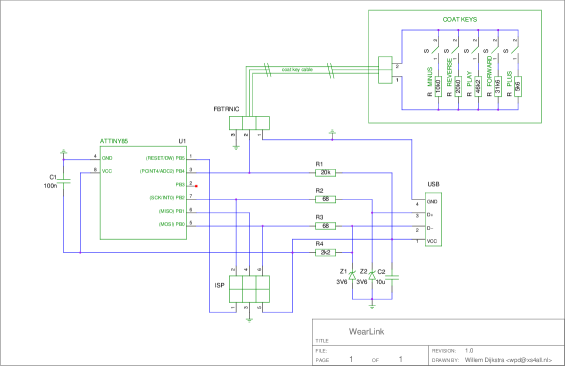
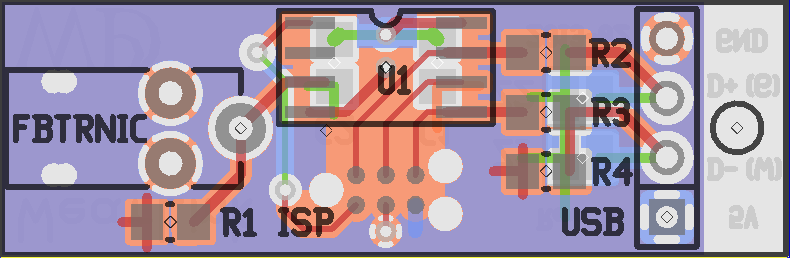
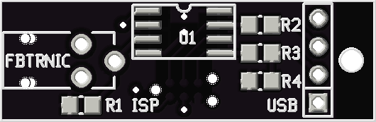
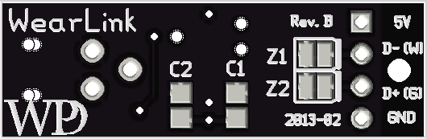

Introduction
------------
When looking for a new winter coat I stumbled on a Taiwanese manufacturer
selling a black and blue winter coat with keys on the sleeve. The coat and keys:

.. image:: .static/tittallon_09B573.jpg
   :align: center

The keys legend betray their intended purpose: volume control, play/pause and
forward/reverse. I listen to podcasts on my phone in the car and on the bike,
and this would make a great way to control those even when wearing gloves!

It turns out that the real keypad is glued to the inside of the sleeve, just
under the outer coat layers. A ruggedized two-wire cable connected the keypad
to a 2.5mm TRS in the left chest pocket.

The keypad is manufactured by `FibreTronic <http://fibretronic.com>`_ under the
moniker connectedwear. They sell a range of keypads (my coat has the `KP2-5SH
<http://fibretronic.com/connectedwear/KP25SH>`_) and a range of controllers
that can be connected to the keypad. Naturally none of their controllers work
for me. So I set out to build my own under these requirements:

* No internal battery. Nothing sucks more than being interrupted whilst
  enjoying total worl^H^H^H^Hcoat domination.

* Default interface to the phone. Ideally no programming on the phone, because
  this somewhat guarantees project longevity.

My solution
-----------

A controller that pretends to be a usb keyboard and emits multimedia keys for
connectedwear keypresses. The controller is powered via usb straight from the
phone.

While looking around for good donor projects I stumbled on the `EasyLogger
<http://www.obdev.at/products/vusb/easylogger.html>`_. A project that uses a
8-pin ATTiny45 with just a few passives to emulate an usb keyboard that reports
back values read by the micro's ADC.

So after:

* Modifying the code to emit multimedia keys
* Connecting the ADC to the coat keys using a 2.5mm trs jack
* Connecting the ATTiny to the phone using a ghetto 4 wire to usb plug

I can now control music on my phone using the keys on my coat. Hooray!

Schematic
~~~~~~~~~

Printed Circuit Board
~~~~~~~~~~~~~~~~~~~~~

Front of the pcb:

Back of the pcb:

Note that a TagConnect header is used for ISP.

Main source file:

Main source file
~~~~~~~~~~~~~~~~
During development I looked around for good information about how to emit multimedia keys. In case I ever forget:

.. literalinclude:: ../../src/firmware/main.c
   :language: c

Download
--------
:download:`wearlink-1.0.tar.gz <wearlink-1.0.tar.gz>`

This contains the directories:

* src: an avr-gcc project, targetting the ATTiny85 including the `Virtual USB port of
  AVR microcontrollers <http://www.obdev.at/products/vusb/index.html>`_ driver.

* schematic: a GEDA/gschem schematic

* layout: a GEDA/pcb layout for a 34x11mm board.

Notes for next time
-------------------

* Do not waste time on PIC microcontrollers. Their development chain leaves
  much to be desired; horrid include files that define and undefine an absolute
  forest of variables, a compiler that keeps telling you how much space can be
  saved if you would only BUY now, and a memory architecture from the previous
  century.

* Determine power draw early in the project for battery constrained
  applications. My current solution comes in at a 18mAh, which is not that
  great.
